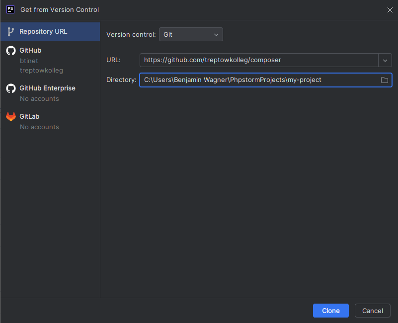

# PHP Framework Template

## Einrichtung

### Repository klonen

Erstelle ein neues Projekt, indem du ``Get from VCS`` wählst
und diesen Repository klonst.



### Packages installieren

Verwende ``composer install`` zum Installieren aller Packages.

### Environment einrichten

Die Datei ``/config/env.bak.yaml`` muss nach ``config/env.yaml``
umbenannt werden.

In dieser Datei kannst du zum Beispiel Angaben zur Datenbank-Verbindung
machen. Außerdem kannst du festlegen, ob das Projekt im Entwicklungs- oder
Produktionsmodus laufen soll.

``APP_ENV: dev`` stellt den Entwicklungsmodus ein. Alle anderen Werte setzen
den Produktionsmodus aktiv. Während er Entwicklung können so detaillierte
Fehlermeldungen ausgegeben werden. Im Live-Betrieb ist dies unerwünscht.

### Routing

In der Datei ``config/routes.yaml`` sind bereits einige Routen zu
Demonstrationszwecken angelegt. Passe diese deinen Wünschen an. Die
Routen zeigen auf deine Controller-Klassen.

````yaml
# config/routes.yaml
app_index:
  expression: '/'
  controller: 'App\Controller\AppController'
  method: 'index'
  request: 'get'
````

Das oben gezeigte Beispiel zeigt bei der url ``https://web.domain/`` auf
den Controller ``src/Controller/AppController.php`` und ruft die Methode
``index()`` auf. Allerdings sind hier nur ``GET``-Requests erlaubt. ``POST``-Requests
ignorieren diese Route.

### Controller

Unter ``src/Controller`` bzw. im **Namespace** ``App\Controller`` legst
du deine Controller-Klassen an. Deine Routen kannst du auf diese
Controller bzw. seine Methoden leiten.

````php
<?php
# src/Controller/AppController.php

namespace App\Controller;

class AppController
{

    public function index(): string
    {
        return "Hello World!";
    }

}
````

Passend zur obigen Route wurde hier die Controller-Klasse erzeugt. Für
erweiterte Funktionalitäten können deine Controller-Klassen auch von
``Core\Controller\AbstractController`` erben. So kannst du die implementierte
Template-Engine verwenden:

````php
<?php
# src/Controller/AppController.php

namespace App\Controller;

use Core\Controller\AbstractController;

class AppController extends AbstractController
{

    public function index(): string
    {
        return $this->render('app/index.html', [
            'controllerName' => "AppController",
        ]);
    }

}
````

### HTML-Templates

Deine Templates kannst du unter ``templates/`` anlegen. Du findest hier
auch schon ein Beispiel.

````php
<?php
# templates/app/index.html.php

/**
 * @var string $controllerName
 */
 
// übergeordnetes Template
$this->layout('base.html');
?>

<?php $this->start('body') ?>
<section class="bg-light border-bottom">
    <div class="container">
        <h1>Hello World!</h1>
    </div>
</section>

<section>
    <article class="container">
        <p class="lead">Diese Seite wurde von "<?=$controllerName?>" aufgerufen.</p>
        <p>Bearbeite die Datei <code>/templates/app/index.html.php</code>, um den Inhalt anzupassen.</p>
    </article>
</section>
<?php $this->stop()?>
````

### Dev-Server starten

Da der php-interne Entwicklungsserver leider keine ``.htaccess``-Dateien
verarbeiten kann (das sind Config-Dateien für den Apache-Server), werden
hierbei keine assets gefunden. Daher empfiehlt sich hier lieber der
Symfony-Entwicklungsserver, der wie folgt gestartet/gestoppt wird:

````bash
symfony server:start
symfony server:stop
````

Zum Testen des Projekts ohne die Einbindung der Assets geht auch:

````bash
php -S localhost:3000 index.php
````